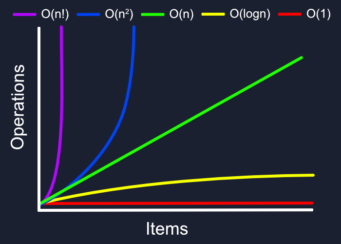

# Asymptotic Notation

---

[**Asymptotic Analysis**](Asymptotic%20Notation%205ee913fb09c24db183ebd64e4b5f38b3/Asymptotic%20Analysis%204c4d3265222d41b08e4876eb5ea0f22d.md)

### [**Time and Space complexity**](https://www.simplilearn.com/tutorials/data-structure-tutorial/time-and-space-complexity)

## Space complexity

**Description** The space complexity of an algorithm or a computer program is the amount of memory space required to solve a problem. It is the memory required by an algorithm until it executes completely.

## **What Is Time Complexity?**

we compare time complexity on the **basis of operations** performed on them

Time complexity is defined in terms of how many times it takes to run a given algorithm, based on the length of the input. Time complexity is not a measurement of how much time it takes to execute a particular algorithm because such factors as programming language, operating system, and processing power are also considered.

- how to find time complexity
    1. examine the exact running time

- **Asymptotic Analysis**
    - **f(n)** represents  the **number of instruction’s executed f**or the input value **n**
    - ***Big 0 ensures it wont suddenly behaves exponential and it’ll always behaves linearly(Worst case is linear) best case a linear line er niche thakbe***
    
    - we are not interest in exact time
    - **for if-else statement:**
    **worst case running** = **condition test** + **if or else par**t(*whichever is large*r)
    
    - **if any function has SQUARE term we can eleminate liner and constant and can only work with Square**
    
    - **f(n**) doesn’t grow faster than **g(n)
    least upper bound = g(n)  → big O**
        - **f(n) ≤ c. g(n)**
        
        ***examp :***
        **4n +3 ≤ c . n**
        here we need to take a value of C which is greater than 4n otherwise can’t prove the equation
        - jeitar n to the power er man joto beshi oita f(n to the power)
        - **f(n) = O(g(n))**
        1. **f(n) ≤ c. g(n)**
        
        1. **2 ta loop in a nested way thakle time complexity → O(n2)**
        
    
    - **f(n2)** = squared
    **f(n)** = linear
    **f(constant value) =** constant growth
    - **f any function has SQUARE term we can eleminate liner and constant and can only work with Square**
    
    - ***g(n) = n***
    - **f(n) = O(g(n))**
    - **f(n) = O(n)**
    - **f(n) ≤ c. g(n)**
    
    [Basics of Asymptotic Analysis (Part 4)](https://www.youtube.com/watch?v=_lO-qsfk_0Q&list=PLBlnK6fEyqRj9lld8sWIUNwlKfdUoPd1Y&index=8)
    

## **Logarithm Analysis**

- ****base er power koto hole  value under consideration hobe eitai logarithm***
***Logarithm :***
**log      valueUnder consideration = value
    base**
- 

---

## **Master Theorem**

- **T(n) = aT(n/ b) + f(n)**
- ***T(n) = n^log          [U(n)]
                       b^a***
- **U(n) → h(n)**
- **h(n) = f(n) /  n^Log
                              b^a**

- ***condition for master theorem:*** a ≥  1 and b> 1
- **T(n)**  = time complexity of n

---

[L-2.6: Recurrence Relation [ T(n)= 8T(n/2) + n^2 ] | Master Theorem | Example#1 | Algorithm](https://www.youtube.com/watch?v=FBKjvXGGCJM)

## Reccurance Theorem

---

---

### Explain 3 Asymptotic Notations with graphical representation

Asymptotic notations are mathematical tools used in computer science and mathematics to describe the growth rates of functions and analyze the performance of algorithms. Three commonly used asymptotic notations are Big O notation, Omega notation, and Theta notation.

**Big O Notation (O-notation): Worst Case**

- it used to measure the performance of any algo by providing the order of growth, it gives a upper bound on a func by which we can make sure that the function will never grow faster than this upper bound
it gives the approximate runtime
we are not inetrest in exact rtime
- **Definition:** Big O notation represents an upper bound on the growth rate of a function. It describes the worst-case scenario or the upper limit of an algorithm's running time.

## **Theta Notation (Θ-notation): Average case**

- **Definition:** Theta notation represents both an upper and lower bound on the growth rate of a function. It provides a tight bound on the algorithm's running time.

**Omega Notation (Ω-notation):BEst CASE**

- **Definition:** Omega notation represents a lower bound on the growth rate of a function. It describes the best-case scenario or the lower limit of an algorithm's running time.

---

In the graphical representations:

- The x-axis typically represents the input size (n), and the y-axis represents the time complexity of the algorithm.
- The curves show the growth rate of the algorithm for different input sizes.
- For Big O notation, the curve should be an upper bound on the actual growth rate.
- For Omega notation, the curve should be a lower bound on the actual growth rate.
- For Theta notation, the curve should sandwich the actual growth rate, providing both upper and lower bounds.

These notations help algorithm analysts and developers understand how the performance of an algorithm scales with input size and make informed decisions about choosing the most efficient algorithms for specific tasks.