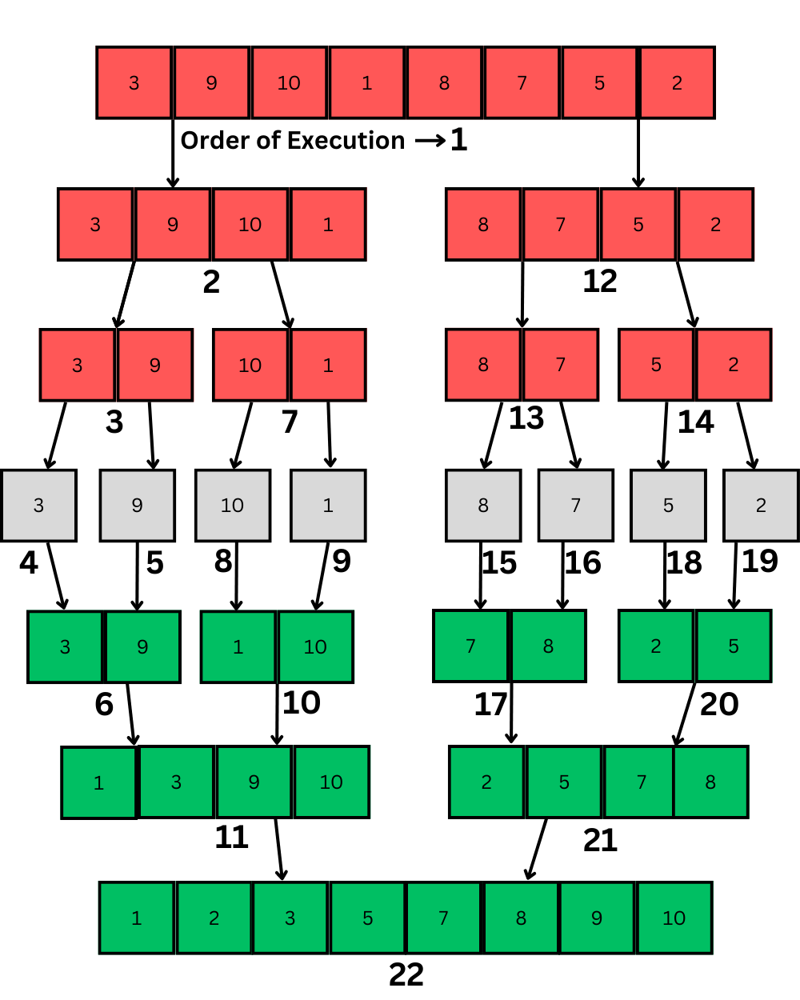

# MErge Sort

## Merge Sort

Follows Divide and Conquer

**Time complexity : Nlogn**

1. first divide the array into many sub division
2. then merge the divided divison but the element of each sub division will merge sorted
3.   ***PseudoCode / algorithm: 
mergeSort(array, firs_element,lastelement )***
(1) low = first element
2. high = last element of array
3. if low< high
4. div = low+high) / 2 **{take floor value}
5.** (repeat) ***mergeSort(array, firs_element,lastelement )
6. mergeSort(array, div+1 ,lastelement )
7.*** merge(araray, first,last , div)

[How Merge Sort Works?? Full explanation with example](https://youtu.be/tn9hxD8gx2M?si=j3WNY7YNMa0FY_EY)

[Merge Sort | Algorithm | Pseudocode | Dry Run | Code | Strivers A2Z DSA Course](https://www.youtube.com/watch?v=ogjf7ORKfd8)



- **Code**
    
    ```cpp
    #include <iostream>
    using namespace std;
    
    /* Function to **merge the subarrays of a[]** */
    void **merge**(int a[], int beg, int mid, int end)
    {
        int i, j, k;
        int n1 = mid - beg + 1;
        int n2 = end - mid;
    
        int LeftArray[n1], RightArray[n2]; // temporary arrays
    
        /* copy data to temp arrays */
        for (int i = 0; i < n1; i++)
            LeftArray[i] = a[beg + i];
        for (int j = 0; j < n2; j++)
            RightArray[j] = a[mid + 1 + j];
    
        i = 0;   /* initial index of first sub-array */
        j = 0;   /* initial index of second sub-array */
        k = beg; /* initial index of merged sub-array */
    
        while (i < n1 && j < n2)
        {
            if (LeftArray[i] <= RightArray[j])
            {
                a[k] = LeftArray[i];
                i++;
            }
            else
            { a[k] = RightArray[j];
                j++; }
            k++;
        }
        while (i < n1)
        {
            a[k] = LeftArray[i];
            i++;
            k++;
        }
    
        while (j < n2)
        {
            a[k] = RightArray[j];
            j++;
            k++;
        }
    }
    
    void **mergeSort**(int a[], int beg, int end)
    {
        if (beg < end)
        {
            int mid = (beg + end) / 2;
            **mergeSort(a, beg, mid);
            mergeSort(a, mid + 1, end);**
            **merge(a, beg, mid, end);**
        }
    }
    
    /* TODO: Function to **print the array** */
    void **printArra**y(int a[], int n)
    {
        int i;
        for (i = 0; i < n; i++)
            cout << a[i] << " ";
    }
    
    int main()
    {
        int a[] = {11, 30, 24, 7, 31, 16, 39, 41};
        int n = sizeof(a) / sizeof(a[0]);
        cout << "Before sorting array elements are - \n";
        printArray(a, n);
        **mergeSort(a, 0, n - 1);**
        cout << "\nAfter sorting array elements are - \n";
        printArray(a, n);
        return 0;
    }
    ```
    

- The average no of comparisions performed by merge sort algo us merging 2 sorted list of length 2 is

[Merge Sort - javatpoint](https://www.javatpoint.com/merge-sort)

[Merge Sort (With Code in Python/C++/Java/C)](https://www.programiz.com/dsa/merge-sort)

**Complexity Analysis**

- **Divide Step**:
    - Each time the array is divided into two halves.
    - So, the time complexity of the divide step is O(logn).
        
        2
        
- **Conquer Step**:
    - The conquer step is the time taken to merge the two sorted halves.
    - The time complexity of the conquer step is O(n).
- **Overall Time Complexity**: O(n log2n).
- **Time Complexity**:
    - Best Case: O(n log2n)
    - Average Case: O(n log2n)
    - Worst Case: O(n log2n)
- **Space Complexity**: O(n): The space complexity of the **merge sort** algorithm is **linear**. Because the algorithm uses an extra array to store the two halves.

**Calculating the Time Complexity Using Master Method**

