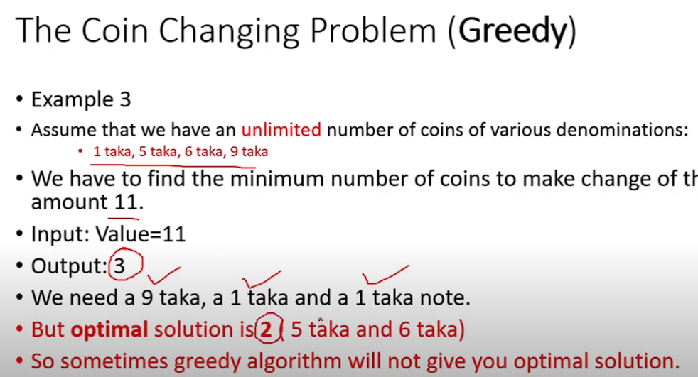

# Coin Change GREEDY

- I**ntroduction**
    - **Coin Change Problem** is a problem in combinatorial optimization.
    - It is similar to the **Fractional Knapsack Problem**. But, in this problem, the items are coins of different denominations, and we have to make a change of a certain amount using the minimum number of coins.
    - The **Coin Change Problem** is a classic problem in computer science and is used in various applications such as vending machines, currency exchange, and financial software.
    - This problem can be solved using **Dynamic Programming** and **Greedy Algorithm**.
    - In this note, we will discuss the **Greedy Algorithm** to solve the **Coin Change Problem**

- CCP = Greedy Approach
    - Suppose we have a variety of coins consisting of **50**, **25**, **10**, **5**, and **1** denominations. Note that all these coins are integer values.
    - We want to make a change of **63** using the minimum number of coins.
    - The Optimal Solution is to use one **50**, one **10**, and three **1** coins, which makes a total of **3** coins.
    - The output will be [1, 0, 1, 0, 3].
    

---

### **Solution Steps**

1. **Make greedy choices:** Choose the largest denomination coin that is less than or equal to the remaining amount. If there is no such coin, move to the next smaller denomination coin.
2. **Create subproblems:** Reduce the remaining amount by the chosen coin and repeat the process until the remaining amount becomes **0**.
3. **Solve subproblems:** Count the number of coins chosen at each step and return the total number of coins chosen.

### Algorithm

For finding minimum number of coin

1. **(Make greedy choices**)select coin/element with largest calue that is less or equal to amount(max value≤ amount)
2. **(create sub problem**)else , if we cant take the largest available coin anymore move to the next smaller largest element ans so on
3. **(solve sub problem**reapeat (step 1 and 2) until the change amount complete

greedy coin change algo

1. while s>0 do
2. choose a coin if highest denomination bit less or equal to s until we cant take it anymore
3. subtract chosen coin from s
4. reapeat

**Complexity Analysis**

- Best Case Time Complexity: **O(n)**
- Average Case Time Complexity: **O(n)**
- Worst Case Time Complexity: **O(n)**
- Space Complexity: **O(1)**
- Sorting the coins in descending order takes **O(mlogn)** time.
- Overall time complexity is **O(mlogn) + O(n)**.
- As **m** is significantly small, the overall time complexity is **O(n)**.

---

---

### **Change Problem-Minimum number of coins**




[Coin Change Problem in Bangla | Greedy | Dynamic | Recursive Approach | PART 1 | Algorithms](https://youtu.be/z_wxAMUlVPo?si=XzGkCAwlbDZBvQY-)

### CODE

```cpp
#include <iostream>
using namespace std;

const int numCoins = 5;
int output[numCoins];

int greedyCoinChange(int c[], int n, int i) {
    if (n == 0) {
        return 0;
    }
    if (i < numCoins && c[i] <= n) {
        output[i]++;
        return 1 + greedyCoinChange(c, n - c[i], i);
    } else {
        return greedyCoinChange(c, n, i + 1);
    }
}

int main() {
    int numCoins = 5;
    int c[numCoins] = {50, 25, 10, 5, 1};
    int n = 87;

    // Initialize output array to zeroes
    for (int i = 0; i < numCoins; i++) {
        output[i] = 0;
    }

    int result = greedyCoinChange(c, n, 0);

    cout << "Minimum number of coins needed: " << result << endl;

    cout << "Coins used:" << endl;
    for (int i = 0; i < numCoins; i++) {
        if (output[i] > 0) {
            cout << c[i] << " x " << output[i] << endl;
        }
    }

    return 0;
}

```