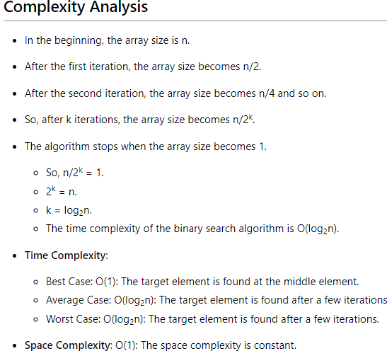

# Binary

### Binary Search

**All the data must stay in Sorted way**

**The time complexity of binary search is O(log n), where `n` is the length of the array.**

- to find Binary search Steps :  (log2^n)  here n = how many array index created

Binary search is a search algorithm that finds the position of a target value within a sorted array. The algorithm compares the target value to the middle element of the array. If they are not equal, the half of the array in which the target value cannot be will be eliminated and the search continues on the remaining half, again taking the middle element to compare to the target value, and so on until either the target value is found or the entire array has been searched.

Here's how the binary search algorithm works:

1. Initialize variables:
    - **`left`** to 0, which is the index of the leftmost element in the array
    - **`right`** to **`n-1`**, which is the index of the rightmost element in the array, where **`n`** is the length of the array.
2. While **`left <= right`**, repeat the following steps:
    - Calculate **`mid`** as the floor of **`(left + right) / 2`**
    - If the element at index **`mid`** is equal to the target value, return **`mid` (element found)**
    - If the element at index **`mid`** is greater than the target value, update **`Low`** to **`mid - 1`**
    - If the element at index **`mid`** is less than the target value, update **`High`** to **`mid + 1`**
3. If the target value is not found after the loop, return **`1`**.
4. 

```
int a[] = {1,2,3,4,5};
    int mid,high =sizeof(a)/sizeof(a[0]) -1,low = 0;
    int x;
    scanf("%d",&x);
    while(low<=high)
    {
        mid = (high+low)/2;
        if(a[mid]==x)
        {
            printf("element found");
        }
        
      else  if(a[mid]>x)
        {
            high = mid - 1;
        }
        else
        {
            low = high+1;
        }
    }
   
```



